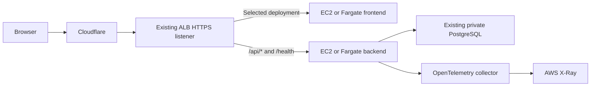

# Practice ECS and Fargate alongside EC2

## Goal and traffic flow

Keep EC2 for server administration and Ansible practice. Run a second copy of the app on Fargate when practicing ECS. Both copies use the existing ALB, private RDS database, S3 assets and Parameter Store values.



The frontend uses the relative API URL `/api`. The browser therefore sends frontend and API requests to the same website hostname. The ALB chooses their destinations; the frontend does not need the backend's container IP.

## What the template adds and why

| Resource | Purpose |
| --- | --- |
| Backend and frontend task definitions | Specify the images, ports, CPU, memory, health checks and logging configuration. A task definition is a recipe; registering it does not start a container. |
| Two ECS services | Maintain the requested number of tasks and register their IP addresses with the ALB. |
| Two IP target groups | Keep Fargate targets separate from the existing EC2 target groups. ECS updates task addresses when tasks are replaced. |
| Two task security groups | Allow port 8000 or 80 inbound only from the ALB security group. Public IP addresses provide outbound connectivity, while these rules control inbound access. |
| One RDS ingress rule | Permit PostgreSQL port 5432 from the Fargate backend security group. The existing EC2 rule remains available. |
| Imported health and API listener rules | Let CloudFormation change the destinations of the two existing rules at priorities 1 and 2. |
| Frontend listener rule at priority 3 | Switch all remaining paths, including `/`, to the selected frontend. |
| Practice log group | Store frontend, backend and collector logs for seven days. |

The collector runs inside the backend task alongside the backend container. They share the task's network namespace, so `127.0.0.1:4318` connects the backend to its collector. They also share the backend task's total CPU and memory allocation.

The execution role lets ECS pull images, read the six existing parameters and send container logs. The task role lets the collector send traces to X-Ray. Parameter Store injects values when a task starts; a running task does not automatically reload changed parameters.

Backend tasks use 0.5 vCPU and 1 GiB total memory: 256 MiB for the collector and 768 MiB for the backend. Frontend tasks use 0.25 vCPU and 0.5 GiB. Both run Linux x86 images.

## Two controls with different jobs

| ActiveDeployment | FargateDesiredCount | Result |
| --- | --- | --- |
| `ec2` | `0` | Traffic selects EC2; Fargate services have no tasks. Initial deployment setting. |
| `ec2` | `1` | Traffic selects EC2; Fargate runs so you can check its health before switching. |
| `fargate` | `1` | Traffic selects Fargate; EC2 can be stopped after verification. |
| `fargate` | `0` | Rejected by the template's parameter rule. |

`DesiredCount` is a service instruction. If it is one and you stop an individual task, ECS replaces that task. Set it to zero to stop practice compute.

`ActiveDeployment` changes ALB weights: the selected target group gets weight one and the other gets zero. Both groups stay associated with the ALB so ECS can start tasks before cutover. This is a manual switch, not automatic failover. If the selected deployment is unhealthy, the ALB does not transfer its traffic to the other deployment.

ALB rules update individually. A switch can briefly route frontend and API requests to different versions while the update propagates. Use compatible application versions and check the final routing before stopping the previous deployment.

## Costs before starting tasks

Estimates for Ohio, Linux x86 On-Demand, 730 hours per month, checked October 7, 2026:

| Item | Continuous month |
| --- | ---: |
| Backend task, including collector | $18.02 |
| Frontend task | $9.01 |
| Two task public IPv4 addresses | $7.30 |
| Total additional task compute and IPv4 | **$34.33** |

Two hours per day for 30 days is approximately **$2.82** for these tasks and their public IPs. Logs, traces, image storage and applicable data transfer are additional. A rollout can temporarily run replacement tasks alongside old tasks, increasing usage during that overlap.

At desired count zero, there are no running Fargate tasks or task public IP charges. Existing ALB, RDS, NAT, EC2 disks, stored ECR images and logs still have their own charges. Stopping EC2 does not stop the NAT gateway. This setup uses the public subnets' Internet Gateway for Fargate outbound access and does not create another NAT, ALB, RDS instance or EC2 instance.

Sources: [Fargate pricing](https://aws.amazon.com/fargate/pricing/), [Ohio ECS price list](https://pricing.us-east-1.amazonaws.com/offers/v1.0/aws/AmazonECS/current/us-east-2/index.json), [VPC IPv4 pricing](https://aws.amazon.com/vpc/pricing/).

## Step 1: adopt the existing ALB rules

Use `infra/ecs-routing-import.yaml` for this one-time import. It contains the four already-deployed stack resources and the two existing HTTPS rules. It deliberately leaves new task definitions, services and networking out because a resource import cannot also create or update other resources.

The rule identifiers are recorded in `infra/ecs-routing-import.json`. The existing listener ARN, priorities, path conditions and EC2 backend destination are preserved.

From the repository root, validate both templates:

```powershell
aws cloudformation validate-template --template-body file://infra/ecs-routing-import.yaml --region us-east-2 --no-cli-pager
aws cloudformation validate-template --template-body file://infra/ecs-fargate.yaml --region us-east-2 --no-cli-pager
```

In CloudFormation, select `portfolio-fargate`, then **Stack actions → Import resources into stack**. Upload `ecs-routing-import.yaml`. Provide each existing rule's ARN from the JSON file and keep existing image parameter values. A suggested change set name is `import-existing-backend-routing`.

Review the change set: it should contain **two Import actions**, for `BackendHealthRule` and `BackendApiRule`. Existing cluster, IAM roles and repository should not be modified or replaced. Execute that import and wait for `IMPORT_COMPLETE`. Check drift for the imported resources before the next update; resolve any difference from the actual rules rather than changing traffic during the import.

`DeletionPolicy: Retain` protects these two pre-existing rules when removing the stack. See the cleanup section before deleting any practice resources.

## Step 2: deploy the complete practice setup once

Use a normal **Update stack → Replace current template**, uploading `infra/ecs-fargate.yaml`. Suggested change set name: `add-fargate-practice-services-and-switching`.

Keep the verified network and image defaults. Initial values must be:

```text
ActiveDeployment = ec2
FargateDesiredCount = 0
```

Review the changes. Expect new task definitions, services, security groups, RDS ingress, target groups, log group and frontend rule, plus modifications to the two imported rules. The existing ALB, EC2 target groups, RDS database, VPC and subnets are referenced by parameters, not recreated. Acknowledge IAM capabilities as requested.

Wait for `UPDATE_COMPLETE`. Both ECS services should show desired/running counts zero. Routing should select the EC2 target groups with weight one. If EC2 is stopped, the website will remain unavailable until you start a deployment; creating the stack does not start EC2.

## Step 3: start Fargate and inspect it

Update this same stack using **the current template**, keeping `ActiveDeployment=ec2` and changing `FargateDesiredCount=1`. Review and execute the change set. This is an operating change; you do not need to edit and upload the template again.

Inspect `portfolio-fargate` in ECS:

1. Both services should reach running count one, with no repeated stopped tasks.
2. Both target groups listed in stack Outputs should have a healthy target.
3. Read `/portfolio/practice/fargate` logs for application startup and collector export errors.
4. Check the task details: frontend port 80, backend port 8000, public IP assigned, correct security groups.

Useful service status command:

```powershell
aws ecs describe-services --cluster portfolio-fargate --services portfolio-practice-backend portfolio-practice-frontend --region us-east-2 --query "services[].{Service:serviceName,Desired:desiredCount,Running:runningCount,Pending:pendingCount,Events:events[:3]}" --output json --no-cli-pager
```

For each target group, copy its ARN from stack Outputs:

```powershell
aws elbv2 describe-target-health --target-group-arn <copied-target-group-arn> --region us-east-2 --no-cli-pager
```

Replace the placeholder before running. ALB `/health` only proves the backend process answers; it does not prove a database query works. Test a database-backed API and login after switching. Starting tasks also requires the RDS database to be available for those operations.

## Step 4: switch traffic to Fargate

After both target groups are healthy, update the same stack using its current template:

```text
ActiveDeployment = fargate
FargateDesiredCount = 1
```

Wait for completion. Inspect all three HTTPS rules: `/health`, `/api/*`, and `/*` should select Fargate with weight one. Test the website, a database-backed page, and admin login. Confirm new logs appear in the practice group and sampled traces reach X-Ray.

After these checks, stop `portfolio-app-ec2` manually. CloudFormation does not control that existing instance's power state. RDS must remain available to the active application.

## Step 5: return to EC2 and stop Fargate

1. Start `portfolio-app-ec2`.
2. Confirm both existing EC2 target groups are healthy and the containers are running.
3. Update the current stack template to `ActiveDeployment=ec2`, keeping desired count one.
4. Wait for completion and test website/API/login on EC2.
5. Update desired count to zero, keeping `ActiveDeployment=ec2`.
6. Verify both Fargate services have desired/running/pending counts zero and old tasks are stopped.

When you finish all practice, you can also stop EC2. The website will be unavailable with both deployments stopped. The ALB and other retained infrastructure continue to incur their usual costs.

Use CloudFormation for these parameter changes to keep the stack consistent. Changing desired count directly in ECS is possible but creates drift from the template.

## Troubleshooting and rollback

- Image-pull or parameter errors: check public subnet routes, assigned public IP, HTTPS egress, image URI and execution role permissions. Never paste decrypted secrets into logs or tickets.
- Database failures: check RDS availability and its port 5432 ingress from the backend task security group. Do not make the database public.
- Unhealthy targets: check container ports, `/health` or `/`, task startup logs and ALB-to-task security group rules.
- Collector failures: inspect the collector log stream, its configuration and task-role X-Ray permissions. `START` orders container startup; it does not certify that the receiver is ready.
- Failed ECS deployments: inspect service events and stopped-task reasons. The circuit breaker can roll back task deployments; it does not automatically switch ALB traffic back to EC2.
- Website failure after switching: bring EC2 up, verify its targets, and update `ActiveDeployment=ec2`. Keep Fargate running until the switch completes if you need to investigate its logs.

Both deployments share the same database and signing key. Database changes and writes are real shared changes. Do not run incompatible schema migrations or reset credentials as part of switching practice.

The EC2 security alarms watch its original log group. Fargate writes to the separate practice group, so those metric filters do not count Fargate logins. Inspect the practice logs and traces during this lesson.

## Removing the practice deployment later

Stopping practice requires desired count zero; it does not require deleting the stack.

If you decide to remove it completely, first return to healthy EC2 routing and stop Fargate. Then perform a **normal stack update** with `ecs-routing-import.yaml` as a cleanup template, preserving the two image parameter values. This restores the imported rules to their single EC2 backend destination and removes the new frontend rule, services, task definitions, target groups and network rules. Review the deletion actions before executing. Do not use the Import operation for this cleanup update.

Only after that cleanup update succeeds should you consider deleting the remaining stack. The imported rules and collector repository are retained. The practice log group is also retained by the cleanup update and continues to exist outside the stack, with seven-day retention. Recreating the same named log group later requires importing or deliberately handling that retained resource.

Do not directly delete the full stack while its retained routing rules still reference Fargate target groups; those references can block target group deletion.

References: [CloudFormation resource imports](https://docs.aws.amazon.com/AWSCloudFormation/latest/UserGuide/resource-import-existing-stack.html), [ECS with an ALB](https://docs.aws.amazon.com/AmazonECS/latest/developerguide/alb.html), [ALB weighted forwarding](https://docs.aws.amazon.com/elasticloadbalancing/latest/application/rule-action-types.html).
